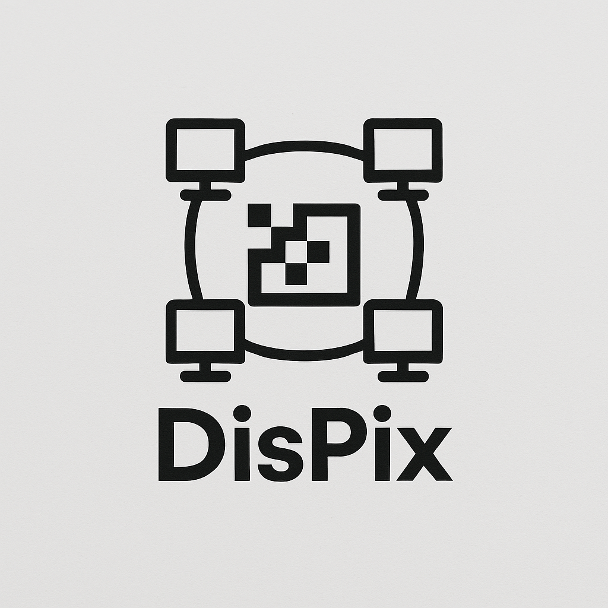

<p align="center">
  
</p>

# 🖼️ DisPix: Procesamiento Distribuido de Imágenes

**DisPix** es un sistema distribuido que permite aplicar filtros de imagen (como negativo, desenfoque, pixelado, etc.) mediante una arquitectura basada en el modelo **máster-worker** y comunicación por **Redis Pub/Sub**. Es ideal para demostrar conceptos de paralelismo, procesamiento distribuido y sistemas web interactivos.

---

## 🚀 Objetivo del Proyecto

Permitir el procesamiento paralelo de imágenes a través de un sistema distribuido simple, reutilizando herramientas como [**Flask**](https://flask.palletsprojects.com/), [**OpenCV**](https://opencv.org/) y [**Redis**](https://redis.io/) para distribuir tareas de forma eficiente.

---

## 🧱 Arquitectura General

- **Máster (servidor Flask):**
  - Carga imágenes desde la web.
  - Divide la imagen en bloques.
  - Publica tareas en Redis.
  - Espera los resultados enviados por los workers vía POST.
  - Reensambla los resultados.
  - Ofrece una interfaz de usuario interactiva.

- **Workers:**
  - Suscritos a Redis.
  - Aplican filtros sobre bloques de imagen.
  - Devuelven los resultados al máster mediante solicitudes HTTP POST hacia el endpoint `/result`.

- **Redis (Pub/Sub):**
  - Coordina la distribución de tareas entre máster y workers a través de un canal compartido llamado `dispix-tasks`.

---

## 🗂️ Estructura del Proyecto

```
DisPix/
├── master/                  # Servidor Flask y lógica central de control del sistema
│   ├── app.py              # Punto de entrada principal del servidor web
│   ├── requirements.txt    # Dependencias del máster
│   ├── data/               # Carpeta para almacenamiento de imágenes
│   │   ├── logs/               # Información de ejecución y reconstrucción
│   │   ├── processed_images/   # Imágenes finales procesadas
│   │   ├── received_blocks/    # Bloques individuales enviados por los workers
│   │   └── uploaded_images/    # Imágenes cargadas por los usuarios
│   ├── static/             # Recursos estáticos para la interfaz web
│   │   ├── favicon.ico
│   │   ├── logo.png
│   │   ├── script.js           # Lógica del frontend (envío de formularios, redirecciones)
│   │   └── style.css           # Estilos CSS para la página
│   ├── templates/          # Plantillas HTML para renderizado con Flask
│   │   ├── index.html          # Página de carga de imagen
│   │   └── results.html        # Página que muestra los resultados finales
│   └── utils/              # Funciones auxiliares del máster
│       ├── image_reconstructor.py  # Reensamblaje de imagen a partir de bloques
│       └── redis_publisher.py      # Publicador de tareas al canal Redis

├── workers/                # Código de los workers distribuidores de carga
│   ├── requirements.txt    # Dependencias específicas de los workers
│   ├── subscriber_redis.py # Script principal del worker (subscripción + envío POST)
│   └── utils/
│       └── image_filters.py    # Implementación de filtros de imagen disponibles

└── pub-sub/                # Scripts auxiliares para Redis y pruebas de comunicación
    ├── requirements.txt
    ├── data/
    │   └── logs/                # Logs de prueba de los canales Redis
    ├── scripts/
    │   ├── start_redis.sh       # Inicia el servidor Redis local
    │   └── stop_redis.sh        # Detiene el servidor Redis
    └── test-redis/
        ├── publisher_test.py    # Prueba de publicación de mensajes
        ├── subscriber_test.py   # Prueba de recepción de mensajes
        └── run_test.sh          # Script que automatiza publisher + subscriber de prueba
```

---

## ⚙️ Instalación

1. Clona el repositorio:
```bash
git clone https://github.com/tu-usuario/dispix.git
cd dispix
```

2. Crea un entorno virtual e instala dependencias:
```bash
python -m venv venv
source venv/bin/activate  # En Windows: .\venv\Scripts\activate
pip install -r master/requirements.txt
pip install -r workers/requirements.txt
pip install -r pub-sub/requirements.txt
```

---

## ▶️ Ejecución del Sistema

### 1. Iniciar Redis
```bash
bash pub-sub/scripts/start_redis.sh
```

### 2. Ejecutar el servidor Flask
```bash
cd master
python app.py
```

### 3. Lanzar uno o más workers
```bash
cd workers
python subscriber_redis.py
```

### 4. Accede desde el navegador
```
http://localhost:5000
```

---

## 💪 Pruebas de Comunicación

Para verificar el canal Redis:

```bash
cd pub-sub/test-redis
bash run_test.sh
```

Esto inicia un publisher y un subscriber de prueba, confirmando el envío/recepción de mensajes.

---

## 🎨 Filtros Disponibles

- **Negativo**
- **Desenfoque**
- **Pixelado**

Cada worker recibe un bloque de imagen y aplica el filtro indicado en la tarea.

---

## 🛠️ Estado del Proyecto

- [x] Comunicación máster-worker por Redis
- [x] Reensamblado correcto de bloques
- [x] Interfaz web funcional
- [x] Procesamiento paralelo de bloques
- [ ] Validación de errores y reintentos
- [ ] Nuevos filtros (Bordes, Escala de grises, etc.)

---

## 📃 Licencia

Este proyecto está licenciado bajo los términos de la licencia MIT. Consulta el archivo `LICENSE` para más detalles.

---